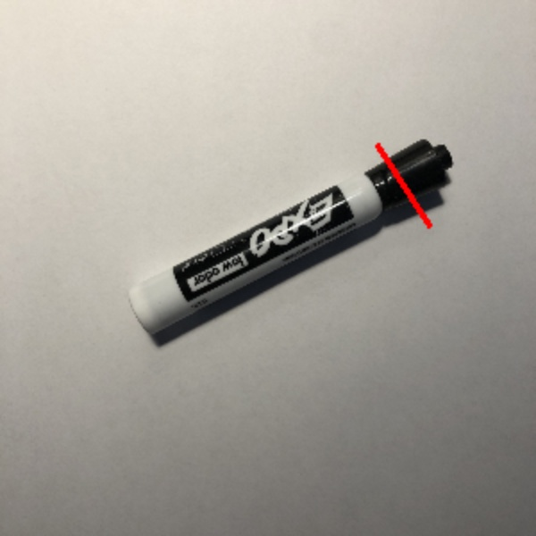

# Generative Grasping CNN (GG-CNN) Implemented for Edge TPU

## Goal
Train and minimally implement the GG-CNN model for an Edge TPU accelerator

The model returns grasp positions, angles, and widths from an RGB image (RGB was used rather than RGBD because the Edge TPU is frequently used with low cost systems without a depth camera)

    

## Credit
Credit for model architecture, `train_ggcnn.py`, and `generate_dataset.py`: https://github.com/dougsm/ggcnn

## Procedure
1. Generate Dataset
    - Download the Cornell Grasping Dataset
        - The official dataset is [here](pr.cs.cornell.edu/grasping/rect_data/data.php), but the website has been down for awhile
        - If still down, use [Kaggle](https://www.kaggle.com/oneoneliu/cornell-grasp) or [The Wayback Machine](https://web.archive.org/web/20200728180352/pr.cs.cornell.edu/grasping/rect_data/data.php)
    - Place dataset files in data/cornell
    - Run `generate_dataset.py`
        - This will create the needed .hdf5 file in data/datasets
2. Train
    - Run `train_ggcnn.py`
    - TensorFlow model files for each epoch will be generated and placed in data/networks
3. Convert
    - Use `convert_ggcnn.ipynb` to convert the TensorFlow model to TFLite and then a Edge TPU compatible model
    - A fully trained and converted model can be found in `/trained_models`
4. Evaluate
    - Run `run_model.py` to evaluate grasps on a single image
        - This code contains a very simple implementation of an evaluation. See credited repo for a more sophisticated execution

## TODO
- Currently post-training quantization is used to enable the model to be compiled for the Edge TPU. Quantization-aware training would lead to a more accurate model. Right now it looks like the Conv2DTranspose layer is not supported for this type of training, but support may be added soon.
- Replace the Cornell Dataset with the [Jacquard Dataset](https://jacquard.liris.cnrs.fr/). This dataset is larger and has become the go-to for 2D grasping model training.
